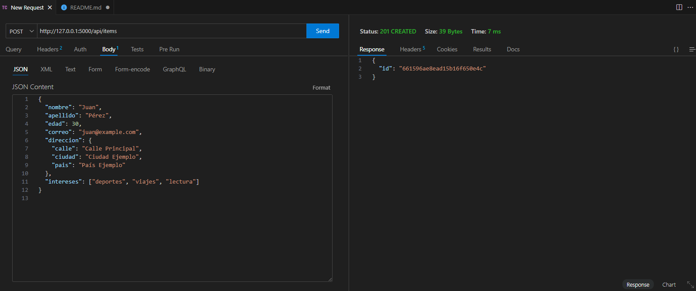
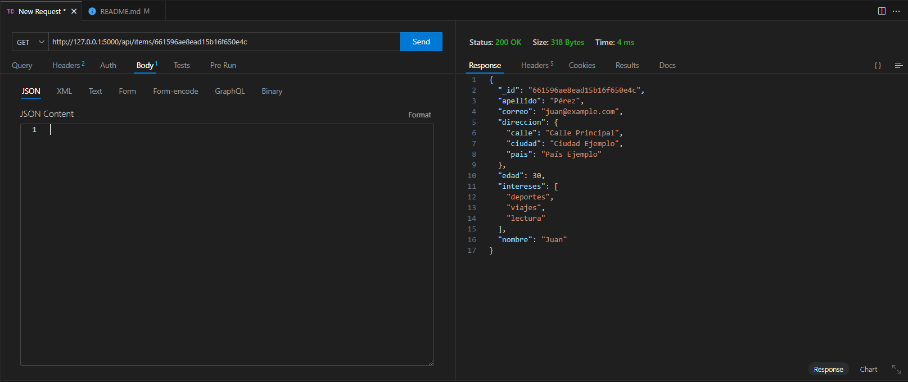
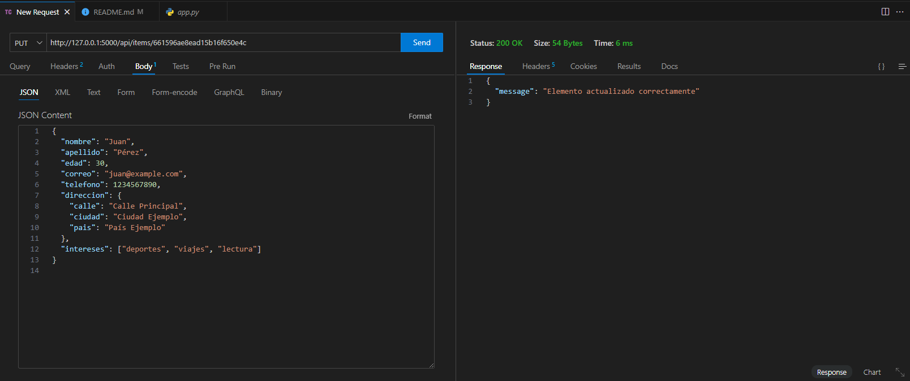
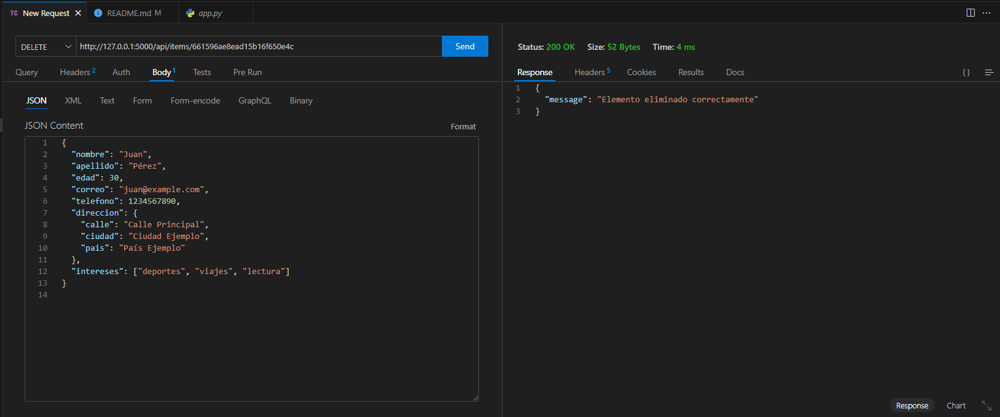

# HospitalRegistros
para esta api se realizan las funciones de un CRUD (solo pruebas no funcina con el frontend todavia)
utiliza esta URL: mongodb://localhost:27017/  para la conexion a MongoDB
e insertara los datos en una coeleccion llamada "test_collection"

descarga de dependencias:
pip install Flask Flask-CORS pymongo

# Configuración de la conexión a MongoDB
client = MongoClient('mongodb://localhost:27017/')
db = client['test_database']
collection = db['test_collection']

correr el servidor con el sig comando:python app.py

para poder revisar la funcionalidad de la API utilizar Thunder Client o Post man
se utilizara la ruta dada por el servidor + /api/items y el metodo que se desea realizar
ya sea GET, POST, PUT Y DELETE

NOTA: tomar en cuenta que el servidor de MongoDB debe estar ejecutandose
# Funcionamineto de la API con MongoDB
||
| ------------- |
| Metodo POST |

||
| ------------- |
| Metodo GET |

||
| ------------- |
| Metodo PUT |

||
| ------------- |
| Metodo DELETE |

# API SQL
 servidor SQL: npm install express mysql 
 Instalar dependencia necesaria (cors): npm install cors 
 correr: node server.js
