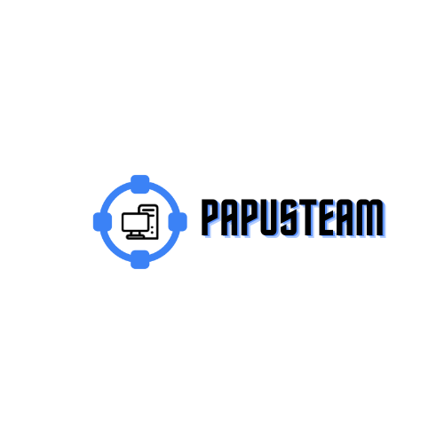
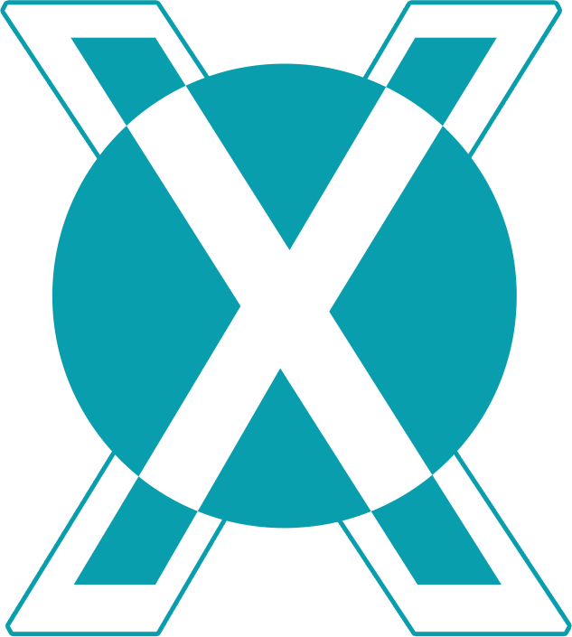
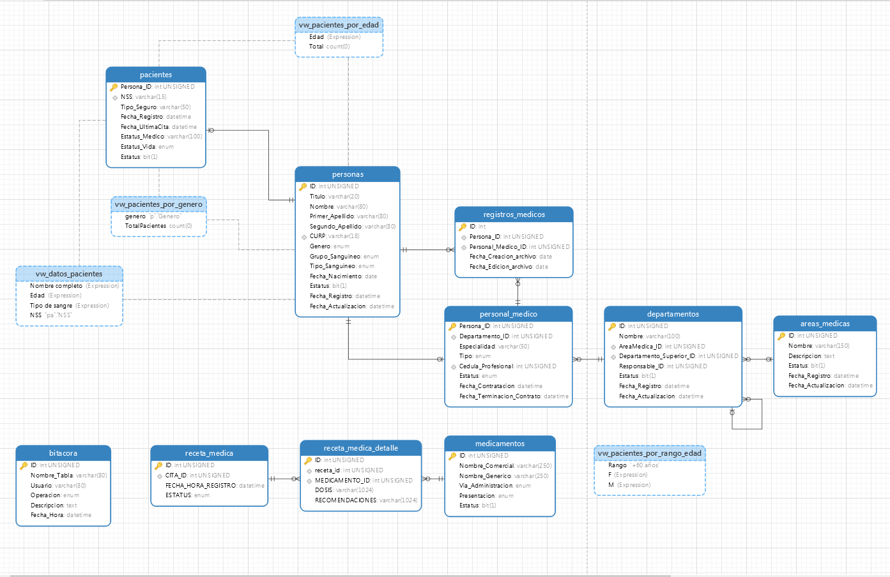
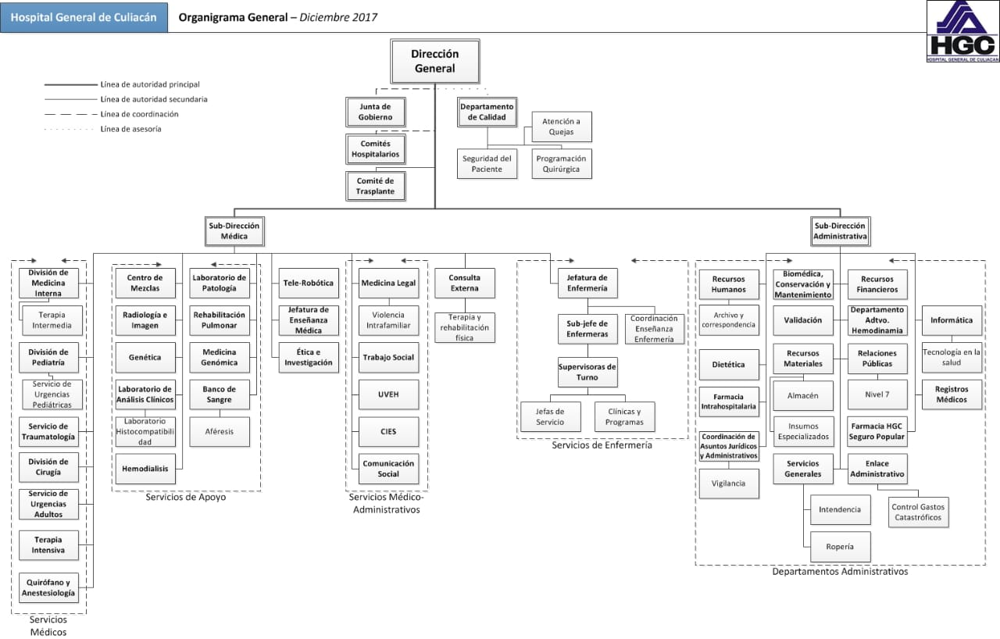
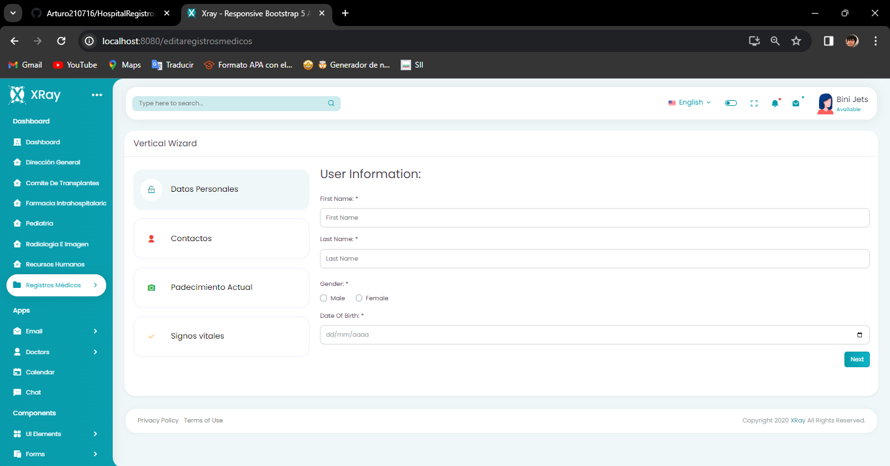
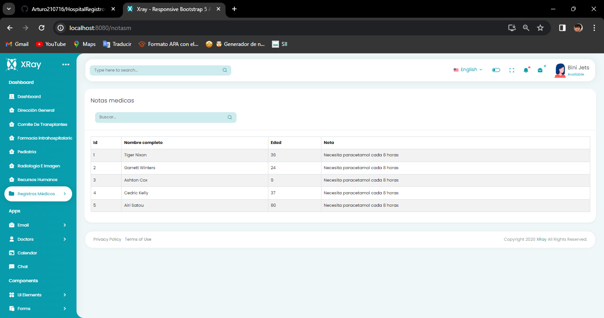
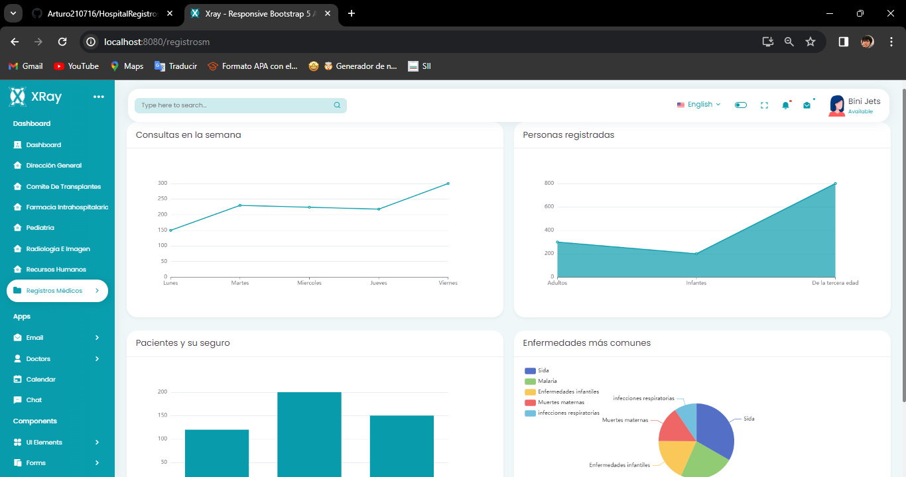

# PapusTeam

| | |
| ------------- | ------------- |
| Logo Empresa | Logo Hospital |

# PrivilegeCare
## Organigrama del Equipo: 

 
 
| Nombre y Apellido| Cargo| Departamento u Organización|
| ------------- | ------------- | ------------- |
| Arturo Aguilar Santos | Desarrollador FrontEnd / Documentador | PapusTeam |
| Jose Angel Gomez Ortiz | Desarrollador Backend / Documentador | PapusTeam |
| Justin Martin Muñoz Escorcia | Líder / DB Manager / Documentador | PapusTeam |

## Objetivo General

Desarrollar un sistema integral de gestión hospitalaria que se centre en un módulo de
Registro Médicos Electrónicos (EHR) específicamente diseñado para su implementación en
hospitales privados. Este sistema tiene como meta primordial optimizar la recopilación,
gestión y utilización de datos de pacientes, con el fin de mejorar la calidad de la atención
médica, aumentar la eficiencia operativa y garantizar la seguridad de la información en el
entorno hospitalario.

## Objetivos especificos

1. Diseñar y desarrollar un módulo de Registro Médicos Electrónicos (EHR) altamente
funcional y personalizable, que se integre de manera fluida con los sistemas de gestión hospitalaria existentes y cumpla con los estándares de seguridad y privacidad de
datos. 
2. Implementar funcionalidades avanzadas de análisis de datos en el módulo EHR, que
permitan a los hospitales aprovechar el potencial de los grandes datos para poder
identificar tendencias de salud y mejorar la toma de decisiones médicas.
3. Garantizar la accesibilidad y disponibilidad de la información del paciente mediante la
creación de interfaces de usuario intuitivas y sistemas de búsqueda eficientes, que
permitan a los profesionales de la salud acceder rápida y fácilmente a los registros
médicos relevantes.
4. Mejorar la calidad de la atención médica al proporcionar a los proveedores de salud
herramientas para personalizar los planes de tratamiento, monitorear la progresión de
las enfermedades y prevenir complicaciones, todo ello basado en análisis precisos de
datos clínicos.
5. Optimizar los procesos administrativos y operativos del hospital mediante la automatización de tareas rutinarias, la reducción de errores de ingreso de datos y la mejora
de la eficiencia en la gestión de recursos y citas médicas.
6. Asegurar la seguridad y confidencialidad de los datos del paciente mediante la implementación de medidas de protección robustas, como la encriptación de datos, los
controles de acceso y las auditorías de seguridad regulares.
7. Facilitar la interoperabilidad del sistema EHR con otras plataformas de salud electrónica, sistemas de información de laboratorio, sistemas de facturación y registros médicos externos, para garantizar una colaboración efectiva entre diferentes entidades
de atención médica.
8. Capacitar al personal hospitalario en el uso efectivo del sistema EHR, proporcionando
capacitación y soporte continuo para garantizar una adopción exitosa y un uso óptimo
de la tecnología.
9. Evaluar periódicamente el rendimiento y la eficacia del sistema EHR mediante la recopilación de retroalimentación de los usuarios, análisis de métricas clave y revisión
de indicadores de calidad de la atención médica, con el fin de realizar mejoras continuas y garantizar la satisfacción del cliente.
10. Promover la innovación y la excelencia en la atención médica mediante la investigación y el desarrollo continuo de nuevas funcionalidades y tecnologías en el ámbito de
los registros médicos electrónicos, con el objetivo de mantenernos a la vanguardia de
las tendencias y necesidades emergentes en el sector de la salud.

## Contexto de negocio

El contexto de negocio de este proyecto se enmarca en el sector de la salud y la atención
médica, específicamente en el ámbito de la gestión hospitalaria en hospitales privados. En
un entorno donde la tecnología juega un papel cada vez más importante en la prestación de
servicios de salud, existe una creciente demanda de soluciones innovadoras que permitan
a los hospitales mejorar la eficiencia operativa, la calidad de la atención y la seguridad de la
información del paciente.

Los hospitales privados, al igual que sus contrapartes públicas, enfrentan desafíos
significativos en la gestión de datos de pacientes, la optimización de procesos
administrativos y la mejora de la experiencia del paciente. Sin embargo, a menudo tienen
recursos financieros y tecnológicos limitados en comparación con los hospitales públicos, lo
que hace que sea aún más crítico encontrar soluciones rentables y personalizadas que se
ajusten a sus necesidades específicas.

En este contexto, nuestro proyecto se posiciona como una respuesta innovadora a estos
desafíos, ofreciendo un sistema integral de gestión hospitalaria centrado en un módulo de
Registro Médicos Electrónicos (EHR). Al proporcionar una plataforma tecnológica avanzada
y adaptable, nuestro objetivo es ayudar a los hospitales privados a mejorar la eficiencia de
sus operaciones, la calidad de la atención médica y la satisfacción del paciente, al tiempo
que garantizamos la seguridad y confidencialidad de la información del paciente.

El mercado de la salud electrónica está en constante crecimiento y evolución, con una
creciente demanda de soluciones que permitan a los proveedores de atención médica
adaptarse a los cambios regulatorios, las tendencias tecnológicas y las necesidades
cambiantes de los pacientes. Nuestro proyecto busca posicionarse como un líder en este
mercado, ofreciendo una solución escalable, flexible y centrada en el usuario que se adapte
a las necesidades únicas de los hospitales privados y les permita mantenerse a la vanguardia
de la innovación en la atención médica

## Organigrama de la empresa

Este organigrama proporciona una estructura general para un hospital, puede adaptarse
según las necesidades específicas de cada hospital o cada clínica. Las áreas principales,
como Dirección General, Subdirección médica, subdirección administrativa, departamento
de calidad, Finanzas y Recursos Humanos aseguran una gestión eficiente del hospital,
abordando tanto las necesidades operativas como las estratégicas para el éxito de la clínica

## Requerimientos funcionales

|**Código** |**Tipo de requisito** |**Descripción del requisito** |
| - | - | - |
|**RF1** |Requisito funcional |El  sistema  debe  permitir  el  registro  de  nuevos  pacientes, capturando información personal y médica relevante. |
|**RF2** |Requisito funcional |Asignación de un identificador único para cada registro. |
|**RF3** |Requisito funcional |El sistema debe permitir a los médicos acceder y actualizar los registros médicos de los pacientes durante las consultas. |
|**RF4** |Requisito funcional |Capacidades de búsqueda y filtrado eficientes. |
|**RF5** |Requisito funcional |Almacenar y acceder a imágenes médicas como radiografías y resonancias magnéticas. |
|**RF6** |Requisito funcional |Permitir  la  exportación  e  importación  de  datos  en  formatos estándar  para  facilitar  la  migración  de  datos  y  compartir información con otros sistemas. |
|**RF7** |Requisito funcional |El  sistema  debe  permitir  el  registro  de  nuevos  pacientes, incluyendo  información  básica  como  nombre,  fecha  de nacimiento, género, dirección y datos de contacto. |
|**RF8** |Requisito funcional |El  sistema  debe  mantener  un  historial  detallado  de  los medicamentos recetados a lo largo del tiempo. |
|**RF9** |Requisito funcional |El  sistema  debe  permitir  la  generación  de  informes personalizados basados en datos de expedientes médicos y notas médicas para análisis clínico, auditorías y presentación de informes. |
|**RF10** |Requisito funcional |El sistema debe mantener un registro de auditoría que registre todas las actividades de acceso y modificaciones realizadas en los expedientes médicos y notas médicas, incluyendo detalles sobre quién accedió y cuándo. |
|**RF11** |Requisito funcional |El  sistema  debe  permitir  la  personalización  y  configuración según  las  necesidades  específicas  de la  institución  médica, incluyendo la capacidad de agregar campos personalizados, formularios y flujos de trabajo específicos. |
|**RF12** |Requisito funcional |Los  usuarios  autorizados  deben  poder  acceder  al  historial completo de expedientes médicos y notas médicas de cada paciente para revisión y análisis. |
|**RF13** |Requisito funcional |El sistema debe permitir la creación y gestión de  diferentes perfiles de usuario, como médicos, personal administrativo y pacientes,  cada  uno  con  diferentes  niveles  de  acceso  y privilegios. |
|**RF14** |Requisito funcional |Ofrecer funciones de anonimización de datos para permitir el uso de información para investigaciones sin comprometer la privacidad de los pacientes. |
|**RF15** |Requisito funcional |Permitir la inclusión y gestión de archivos adjuntos en las notas médicas, como informes de laboratorio, imágenes médicas u otros documentos relevantes. |

## Requerimientos no funcionales

|**Código** |**Tipo de requisito** |**Descripción del requisito** |
| - | - | - |
|**RF1** |Requisito no funcional |El sistema debe garantizar tiempos de respuesta rápidos, incluso en situaciones de carga máxima, para evitar demoras en la atención médica. |
|**RF2** |Requisito no funcional |Garantizar que la interfaz de usuario sea fácil de usar y comprender. |
|**RF3** |Requisito no funcional |La interfaz de usuario debe ser intuitiva y fácil de usar, facilitando la adopción por parte del personal médico con di- ferentes niveles de experiencia técnica. |
|**RF4** |Requisito no funcional |El sistema debe cumplir con regulaciones y normativas lo- cales e internacionales en materia de privacidad y seguridad de datos médicos. |
|**RF5** |Requisito no funcional |Se deben realizar pruebas de usabilidad periódicas con el personal médico para identificar posibles mejoras en la interfaz.|
|**RF6** |Requisito no funcional |Registro y seguimiento de la evolución de pacientes en programas de rehabilitación y terapia física. |
|**RF7** |Requisito no funcional |Se debe mantener un registro detallado de las actividades realizadas en el sistema, facilitando la auditoría y la iden- tificación de posibles problemas de seguridad. |
|**RF8** |Requisito no funcional |Proporcionar materiales de formación y documentación para los usuarios, asegurando que comprendan cómo utilizar el sistema de manera efectiva y segura. |
|**RF9** |Requisito no funcional |Permitir actualizaciones del sistema sin interrupciones sig- nificativas en el servicio, especialmente durante momentos críticos de atención médica. |
|**RF10** |Requisito no funcional |Implementar  mecanismos  de  validación  de  datos  para asegurar la precisión y coherencia de la información ingresada en los registros médicos. |

## Reglas de negocio

|***Código*** |**Reglas** |
| - | - |
|**RN1** |Confidencialidad de la Información: Los datos médicos de los pacientes deben ser tratados con confidencialidad y solo accesibles por personal autorizado. |
|**RN2** |Antes de acceder al expediente médico de un paciente, el personal médico debe obtener el consentimiento informado del paciente o su representante legal. |
|**RN3** |Registro Completo de Datos: Todo encuentro médico debe registrarse de manera completa y precisa en el expediente médico del paciente. |
|**RN4** |Actualización Regular: Los expedientes médicos y las notas médicas deben actualizarse regularmente para reflejar con precisión el historial médico y las condiciones actuales del paciente. |
|**RN5** |Consistencia en la Terminología: Se debe utilizar una terminología médica estandarizada y consistente en todos los registros médicos para facilitar la comprensión y el intercambio de información entre profesionales de la salud. |
|**RN6** |Registro de Auditoría: Se debe mantener un registro de auditoría que registre todas las actividades realizadas en el sistema, incluyendo quién accedió a qué información y cuándo. |
|**RN7** |Restricciones de Acceso por Roles: El acceso a la información médica debe estar restringido según el rol y los privilegios del usuario, limitando el acceso a la información relevante para su función. |
|**RN8** |Integración de Resultados de Laboratorio: Los resultados de pruebas de laboratorio y otros estudios diagnósticos deben integrarse automáticamente en el expediente médico del paciente. |
|**RN9** |Consistencia en el Formato de Notas Médicas: Las notas médicas deben seguir un formato estándar y consistente para facilitar la comprensión y el análisis. |
|**RN10** |Deben registrarse y asociarse los resultados de pruebas de laboratorio a las historias clínicas de los pacientes. |
|**RN11** |Deben  registrarse  de  manera  detallada  las  intervenciones  quirúrgicas, incluyendo fechas, procedimientos y profesionales involucrados. |
|**RN12**|El sistema debe permitir la generación de informes médicos para su revisión interna o entrega a pacientes |
|**RN13** |Se debe mantener un registro detallado de quién accede a los registros médicos y cualquier modificación realizada |
|**RN14** |Proporcionar capacitación regular al personal médico sobre las políticas y procedimientos relacionados con la gestión de registros médicos. |
|**RN15** |Establecer alertas y notificaciones automáticas para eventos críticos, como resultados de laboratorio anómalos o cambios significativos en el estado de salud del paciente. |
|**RN16** |Implementar regularmente copias de seguridad de los registros médicos para garantizar la recuperación de datos en caso de fallos del sistema o pérdida de información. |
|**RN17** |Fomentar  la  inclusión  de  notas  médicas  detalladas  que  describan  el diagnóstico, el plan de tratamiento y la evolución del paciente. |
|**RN18** |Permitir a los profesionales de la salud acceder a la información más reciente durante la atención al paciente. |
|**RN19** |Mantener un historial de versiones de las notas médicas para rastrear los cambios a lo largo del tiempo. |
|**RN20** |Se deben implementar medidas de seguridad robustas, como autenticación de dos factores, para proteger la información confidencial del paciente. |

## Mockups
- Modulo 1: Expedientes Medicos

- Modulo 2: Notas Medicas

- Modulo 3: Dashboard de Registros Médicos

## 📁 Documentación completa:

- [Documentacion](Documentacion/PapusTeam.pdf)
